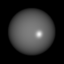
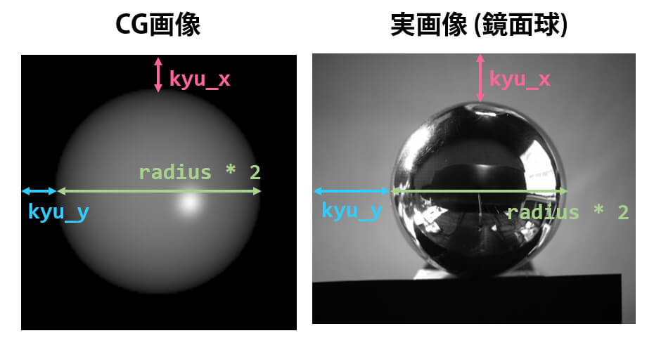

# 鏡面反射を用いた光源方向の算出（キャリブレーション）

光源の方向を算出する際に使う光源方向を計算するプログラム

## 概要

古典的な照度差ステレオなど、コンピュータビジョンの分野では光源方向が必要になる場面が多数存在します。

本プロジェクトでは、鏡面反射を利用することで光源方向を算出します。プロジェクト内にあるプログラム

* 鏡面反射の強いCG球を作成するプログラム
* CG画像 or 実撮影画像(鏡面球)から光源方法を推定するプログラム

の2つを載せております。

## 利用方法

### (1) git clone

まず、以下のコマンドを実行してください。

```
git clone https://github.com/momoyama1192/CalibLightDirection.git
```

言語は、Python3もしくはMATLABに対応しています。

ただし、球の生成をPython3で行い、法線推定をMATLABで行うというような、Python3とMATLABを混合して使うことはできません。


### (2) 事前インストール

※ MATLABの場合、追加プログラムは不要なので、読み飛ばしてもらって構いません。


Python3の場合、`opencv-python` と `numpy` のインストールが必須です。

インストールをしていない場合、以下のコマンドを使うなどして、必ず入れてください。

```
pip install opencv-python
pip install numpy
```

照度差ステレオを体感するだけであればバージョンは特に気にしなくてもOKです。

なお、私は以下のバージョンにて動作確認を行っております。

```
Package        Version
-------        -------
opencv-python  4.4.0.46
numpy          1.18.2
```

### (3) 画像生成 (デバッグ用)

※ 実画像(鏡面球)から光源方向を求める場合は、このステップは不要です。

CG球の画像を生成します。

```
[画像に関する設定]
N_ROW      : 生成する画像の縦方向のピクセル数
N_COL      : 生成する画像の横方向のピクセル数
view       : 視点方向

[物体に関する設定]
radius     : 生成する球の半径
kyu_x      : 生成する球の中心のx座標
kyu_y      : 生成する球の中心のy座標 
K_d        : 球の拡散反射率 (0以上1以下)
K_s        : 球の鏡面反射率 (0以上1以下)
n          : 鏡面反射パラメタ

[光源に関する設定]
light      : 光源方向 (自動的に1に正規化)
I          : 光源強度

[出力に関する設定 (原則変更の必要なし)]
OUTPUT_DIR : 生成した画像、光源方向を保存するディレクトリ (最後の / は不要)
```

パラメーターを指定後、Pythonであれば `make_input_model.py` を、MATLABであれば `make_input_model.m` を実行してください。

実行を行うと、下のようなCG球の画像 `1.png` が `OUTPUT_DIR` で指定されたディレクトリに出力されます。




### (4) 光源方向推定

(3)で生成した球の画像、もしくは撮影された鏡面球から光源方向を推定します。

* 法線マップ（法線の向きを色で可視化した画像）
* 誤差マップ（真値との誤差の度合いを可視化した画像）
* 真値の法線との平均角度誤差（単位はdeg）

設定できるパラメーターは、以下の通りです。

```
[読み込み・書き込みデータに関する設定]
INPUT_DIR   : CG球 or 鏡面球の場所（ディレクトリ）
OUTPUT_DIR  : 光源方向を出力するディレクトリ (最後の / は不要)
extension   : 読み込む画像(CG球 or 鏡面球)の拡張子 

[CG球・鏡面球に関する設定]
※ 下で説明する3つの距離（画素数）を入力すること
radius      : 生成する球の半径
kyu_x       : 生成する球の中心のx座標
kyu_y       : 生成する球の中心のy座標 

[しきい値に関する設定 (原則変更の必要なし)]
spec_border : 鏡面反射のしきい値 (画素値)

[視点方向に関する設定]
R  : 視点方向
```

CG球・鏡面球に関する設定の `radius`, `kyu_x`, `kyu_y` の値は、下の画像の矢印部分の距離（画素数）を入力してください。

※注意:  `radius` は「緑矢印÷ 2の値(半径)」を入れること



さらに実行前に、推定したい光源方向の数だけ `INPUT_DIR` 内にCG球・鏡面球の撮影画像を入れてください。さらにファイル名を `1.png`, `2.png`, `3.png` のように `番号.png` としてください。

（番号順に光源方向を算出します。）

<br>

パラメーターの設定、および `INPUT_DIR` 内に入力画像の準備が終わったら、Pythonであれば `find_ray_direction.py` を、MATLABであれば `find_ray_direction.m` を実行してください。

実行を行うと、光源方向が `OUTPUT_DIR` に保存されます。 保存されるデータは、以下の通りです。

```
[保存内容]
Python: txtファイル
MATLAB: txtファイル, matファイル

[txtファイルの中身(例)]
1.959713822909267822e-01 5.879141468727802078e-01 7.848262057486579124e-01
```

## さいごに

今回は光源方向を算出するプロジェクトについて記述を行いました。

このプロジェクトが、教育、研究の助けとなれば幸いです。また、このコードの改良、利用などはご自由にどうぞ。（リンクを貼っていただけたらありがたいです。）
